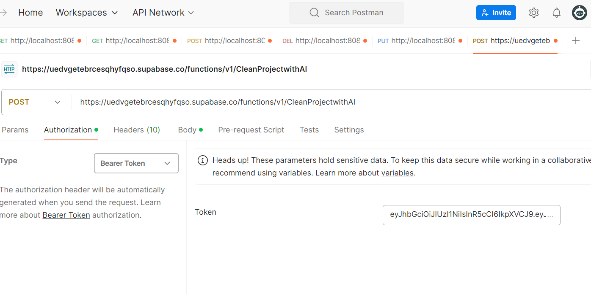

# COS
Capstone Onboarding Project

File structure:

/app
  /employee
    - page.tsx              # Employee's dashboard or home page
    /profile
      - page.tsx            # Employee profile page
    /tasks
      - page.tsx            # Tasks or project-related page for employees
  /student
    - page.tsx              # Student's dashboard or home page
    /profile
      - page.tsx            # Student profile page
    /courses
      - page.tsx            # Courses page for students
  /sign-in
    - page.tsx              # Sign-in page
  /tutorial
    /connect-supabase-steps
      - page.tsx            # Tutorial steps for connecting to Supabase
    /sign-up-user-steps
      - page.tsx            # Steps for user registration

## Implementing interacting with ChatGpt using Supabase Edge Functions and Database webhooks.
### Installation and Setup Option A: NPM
[Supbase CLI](https://supabase.com/docs/guides/local-development/cli/getting-started?queryGroups=platform&platform=windows)

1. install supabase CLI
```bash
npm install -g supabase
```
2. verify the installation
```bash
supabase --version
```
3. Create a new Supabase edge Function
```bash
supabase functions new {function_name}
```
### Installation and Setup Option B: NPX 
1.a instead of npm, npx can be used to run the command without installing it globally
```bash
npx supbase function new {function_name}
```
(**if using npx for installation of supabase, you must include `npx` in front of every command**)
### Run Edge Function Locally
1. Start the Supabase local development environment <br>
 keep in mind that supabase creates a docker container to run the local environment, so make sure you have docker installed and running on your machine
```bash
supabase start
```
2. Run the edge function locally
```bash
supabase functions serve
```
### Deploy Edge Function to Production
[Deploy to Production](https://supabase.com/docs/guides/functions/deploy)
1. Login to Supabase CLI
```bash
supabase login
```
2. Deploy the edge function. You will need to run this command everytime you make changes to the function.
```bash
supabase functions deploy {function_name}
```
### Sending a request to the Edge Function 
1. Because we need to provide the JWT token to edge function can't simply use the URL to send a request. Instead, we can use postman to send a request to the edge function.

* In postman, create a new request and set the method to POST.
* In the URL field, enter the URL of the edge function. It should look something like this: `https://uedvgetebrcesqhyfqso.supabase.co/functions/v1/CleanProjectwithAI`
* In the Authorization tab, select Bearer Token and enter the JWT token. The JWT is the same as the SUPABASE_ANON_KEY in the Supabase project settings.
* In the Body tab, select raw and set the type to JSON. Enter the JSON data that you want to send to the edge function.

